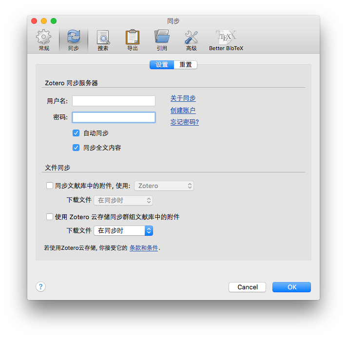
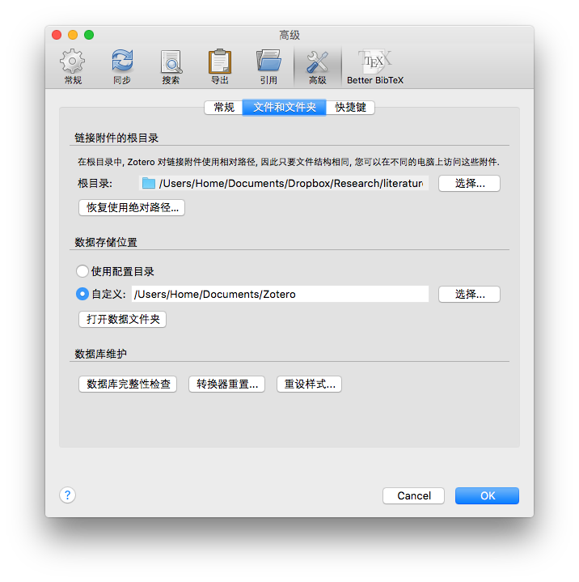
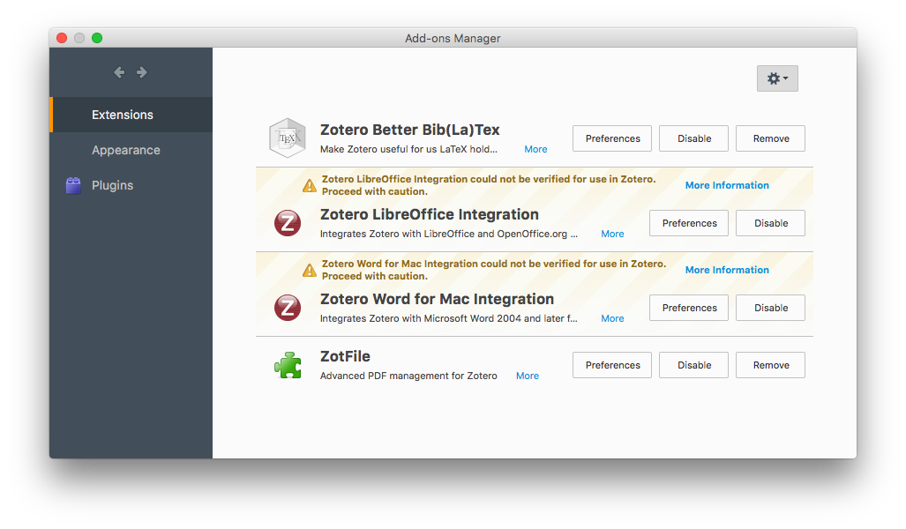
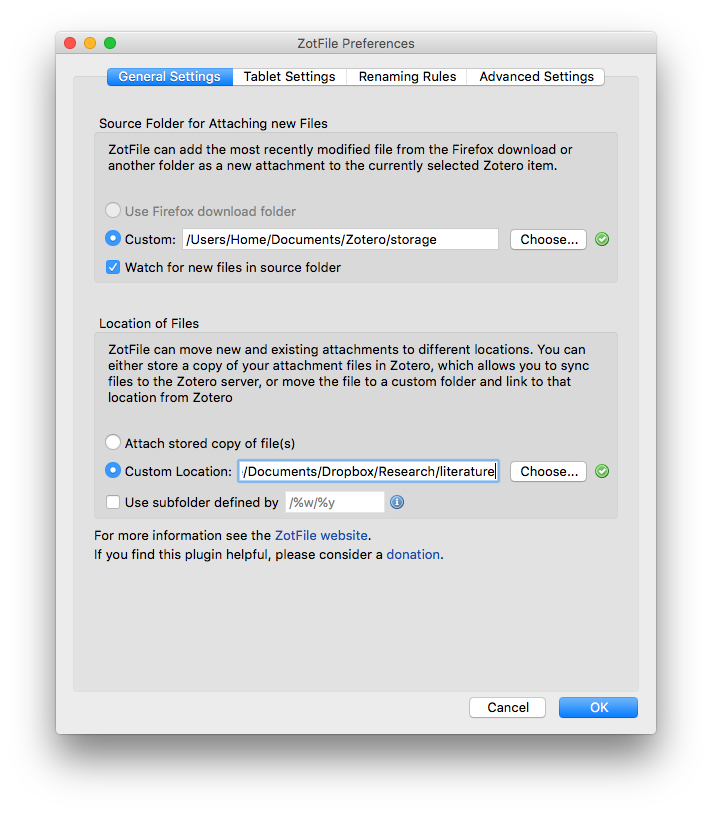

# 实现Zotero条目和附件的跨平台独立同步

## 写在前面
　　首先向[阳志平](http://www.yangzhiping.com/)老师的[Zotero系列教程](http://www.yangzhiping.com/tech/zotero1.html)致敬，他可以说是国内使用Zotero的领路人，大多数人都是看着他的教程入门的。  
　　在阳志平老师的教程里，提到了做storage的软链接，来实现附件与条目的分别同步。这不失为解决问题的一种简洁的方法，然而本文方法同样简洁且相对软链接法有以下优势：  

1. 不用建立软链接(貌似是废话);
2. 实现跨平台同步；
3. 更换网盘和目录非常便捷；

　　后两点优势，都是由于zotero附件类型不同所致。zotfile将zotero默认生成的文件类型的附件，转化为文件链接。这两者的区别是，文件采用绝对路径，而文件链接采用相对路径，这使得跨平台同步成为可能，因为win和*nix的目录结构不太一致。同时，更换网盘和目录只需要在zotero和zotfile中修改两处设置即可。然后在使用了zotfile之后，软链接的使用就显得可有可无了，不如去掉。

##条目同步
　　这里的条目同步指的就是文献信息的同步，这个通过zotero本身就能很容易实现，以下给出一些建议设置。  

1. 设置同步账户并取消内置文件同步  
　　注[册zotero账户](https://www.zotero.org/user/register/)(温馨提示，有google图片验证，需要科学上网)，在`首选项`→`同步`→`设置`中填写账号密码。  
　　zotero免费账户包含300mb同步空间，经测试，zoteo条目的存储并不记录在这300mb以内，但是仍显得太小，故应取消内置文件同步，在`首选项`→`同步`→`设置`中取消`文件同步`下面两个选项的勾选。
　　
2. 取消自动生成快照  
　　zotero默认设置为保存快照，网页快照包含了大量零碎的文件，估计同步起来也会有困难，对于一部分想保留的快照，依旧可以手动保存，所以建议取消自动生成快照。  
　　

## 附件同步
　　附件同步的实现，需要安装zotfile，当然一个可靠的同步盘也是不可或缺的。在进行之前最好先明确两个概念：

> `数据存储位置`和`链接附件的根目录`:  
> 　　`数据存储位置`是zotero本地几乎所有的配置、文献数据库、附件存放的地方，可以说除了可执行文件和插件都在此处。一般来说，并不需要同步。该目录下的`storage`子目录，存放有本地所有`文件`格式的附件，我们需要将`storage`设置为zotfile的监听目录。  
> 　　`链接附件的根目录`是zotero保存文件链接的目录，当zotero以文件链接形式保存附件时，会记住在这目录下找相对路径。

> 附件类型   
> 　　`文件`: 图标为系统默认图标或者adobe红。是zotero默认的附件格式，存放在storage下一个8位数字和字母组成的文件夹内，同文件夹下`.zotero-ft-cache`是附件的内容或提纲，`.zotero-ft-info`是附件文件的一些信息。  
> 　　`文件链接`:图标为白色加小铁链。zotfile生成的链接即文件链接，实际保存在`链接附件的根目录`下。  
> 　　`url链接`:图标为蓝色加小铁链。保存网络文件链接，联网时才能可以打开。  

1. 配置附件链接根目录      
　　建议先修改`首选项`→`高级`→`文件和文件夹`中的`数据存储位置`。选择`自定义`，修改为自己顺手的位置，而后zotero会询问重启，并且大多数配置会丢掉，一般来说安好zotero先修改的是这个。  
　　重启后，重新修改配置，此时，设置`首选项`→`高级`→`文件和文件夹`中`链接附件的根目录`，这就是附件最终存放的位置，因此是同步盘能同步的位置。  
　　

2. 下载安装zofile  
　　任意浏览器点开[官方4.2.6版链接](https://addons.cdn.mozilla.net/user-media/addons/284723/zotfile-4.2.6-fx.xpi)，下载后在zotero中打开`工具`→`插件`，按右上角齿轮选择`Install Add-on Form File ...`，选中刚刚下载的`zotfile-4.2.6-fx.xpi`文件进行安装(Mac和Win版本可以拖拽，为了通用性，不再赘述)。
　　

3. 配置zotfie  
　　打开`ZotFile Preferences ...`，`General Settings`标签页，`Source Folder for Attaching new Files`设置为`数据存储位置`下的`storage`。`Location of Files`设置为`链接附件的根目录`。
　　

4. 同步&Enjoy!  
　　开启同步就好了，对于已经存在本地的附件，请选中所有条目，右键`Manage Attachments`→`Rename Attachments`。

## 其他

1. 软链接方法向本方法的迁移  
　　装zotfile，**除了`附件链接根目录`不动**，剩下都按照本文叙述来，zotfile重命名后，再修改`附件链接根目录`。

2. 修改目录/更换网盘  
　　其实本质还是改目录，将`附件链接根目录`剪切到新位置，修改`附件链接根目录`和`Location of Files`为新位置即可。

## 结语
　　至此，条目和附件的基本配置就已经结束了，如果需要对附件进行更好的组织或者在Zotflie的使用中出现了问题，请去网络上查找相关资料。
